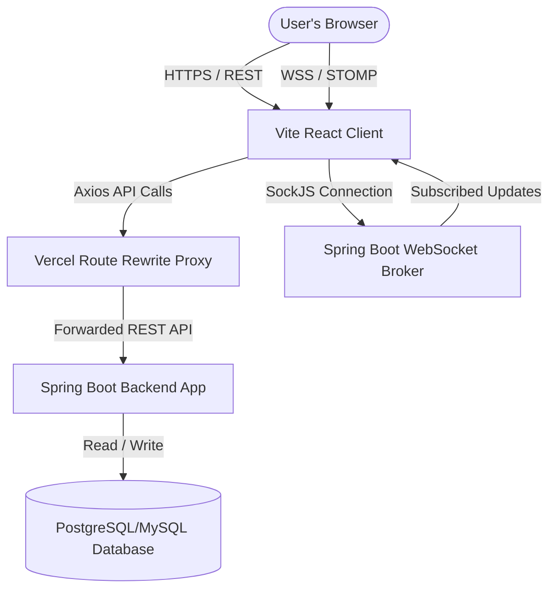
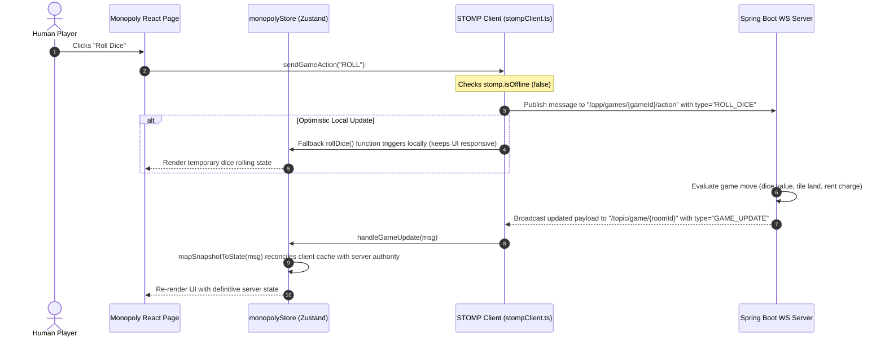
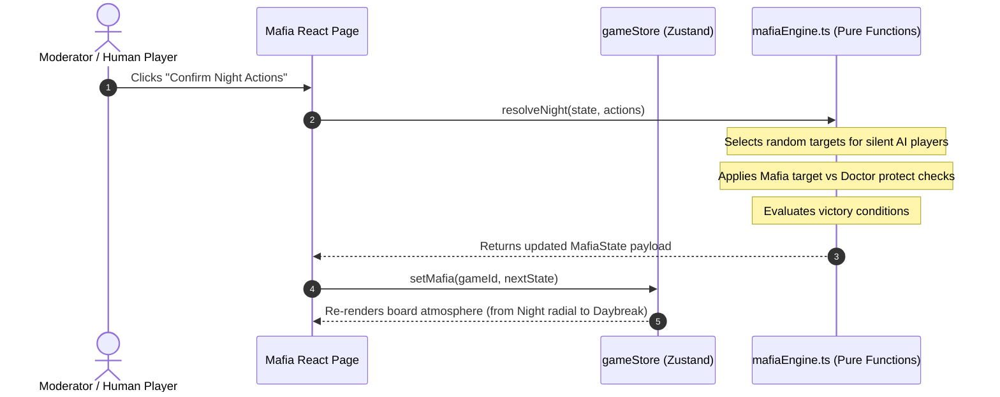

# Project Memory: Architecture (architecture.md)

## System Overview
GameHub operates as a hybrid architecture with a strict separation between client-side user interface (built as a React SPA) and the game state authority (external Spring Boot server).

## Hybrid Operational Modes

### 1. Authoritative Online Mode (Connected)
When the client successfully connects to the external Spring Boot backend (`https://api.pradeepkulal.click` proxying through Vercel or direct URL configuration):
* **State Authority**: The backend processes all state updates, validates moves (e.g. dice rolls, property purchases, trades), and maintains game database state.
* **Synchronization**: The frontend registers subscriptions to WebSocket topics (using STOMP/SockJS) and listens for broadcasts. When a player performs an action, the client sends a message over STOMP to `/app/games/{gameId}/action`. The backend updates state and broadcasts the new game payload to `/topic/game/{roomId}`. All clients receive this payload, parse it, and update their local Zustand stores (`useMonopolyStore`).

### 2. Local Fallback Offline Mode (Single-Device / Demo)
If `VITE_STOMP_URL` is omitted, or if the STOMP connection client reports offline status (`stomp.isOffline` is true):
* **State Authority**: The browser client behaves as the state authority.
* **Simulation Loop**: Interactive moves (rolling dice, resolving board land events, resolving night actions) are evaluated locally in the browser using pure client-side simulation state engines (`mafiaEngine.ts` and `monopolyEngine.ts`). Zustand stores update synchronously in response to these local events, enabling single-device pass-and-play and AI bot matches.

---

## Data and Message Flow

### 1. Online Monopoly Action Flow (WebSocket Authority)

### 2. Mafia Local Simulation Flow (Client-Side Authority)

---

## Module and Directory Interactions

* **Routing Layer (`src/routes/*`)**: Acts as the controller. Captures parameters (like `roomId` and `gameId`), initializes query feeds (`useRoom`, `useGameSnapshot`), subscribes to WebSocket updates via `useStompSubscription`, and binds UI actions to endpoints.
* **Component Layer (`src/components/*`)**: Represents pure visual shells. Subcomponents like `Board.tsx` or `PlayerSeat.tsx` read layout data structures (e.g. `monopolyBoard.ts`) and player status models to render neon layouts.
* **State Layer (`src/store/*`)**: Stores client-side records. Zustand stores are persistent (`gh-lobby`, `gh-monopoly`, `gamehub.auth`) to prevent state loss during page refreshes.
* **Service Client Layer (`src/services/*`)**: Houses REST definitions. Reusable api clients wrap endpoint addresses and handle JWT token additions.
* **WebSocket Service Layer (`src/websocket/*`)**: Registers topic nodes and manages handshake processes. Connects and handles silent reconnections.
