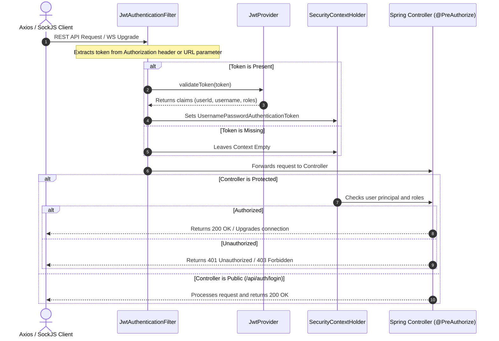

# Project Memory: Authentication & Security Flow (authentication.md)

GameHub implements stateless authentication using JSON Web Tokens (JWT) for both REST endpoint authorization and WebSocket communication security.

---

## User Types and Sessions

### 1. Registered Users
* Players register using username, email, and password. Credentials are encrypted on the backend (Bcrypt).
* Authentication is validated against credentials. Upon verification, the backend issues an access token and a refresh token.
* Access tokens are saved in localStorage under `gh.jwt` and refresh tokens under `gh.jwt.refresh`.

### 2. Guest Users
* Guests can join matches instantly by clicking "Play as Guest" or supplying a name.
* The frontend requests a guest session via `POST /api/auth/guest`.
* The backend generates a temporary UUID user ID, generates a Guest JWT token, and flags `isGuest` to true.
* Guest sessions enable room and game features but restrict changes to profile emails or passwords.

---

## Token Storage and Lifecycle (Client-Side)

The frontend manages token storage using `tokenStore` inside `api.ts`:
* **Token Retrieval**: `localStorage.getItem("gh.jwt")`.
* **Add Header**: Automatically added to all outgoing Axios REST calls via a request interceptor:
```javascript
config.headers.Authorization = `Bearer ${token}`;
```
* **Token Expiration & Refresh**:
  * When an API call fails with status code `401 Unauthorized`, the client automatically wipes local tokens and fires the registered `onUnauthorized` callback.
  * The callback signs the user out of the application and redirects them to the `/login` route.
  * In the background, `authApi.refresh()` checks for the presence of `gh.jwt.refresh` and submits a `POST /api/auth/refresh` request to obtain a new access token.

---

## Reconstructed Security Flow (Spring Security)



---

## Authorization & Roles

* **Role Assignments**: Users are assigned roles (e.g. `ROLE_USER`, `ROLE_GUEST`, or `ROLE_ADMIN`) embedded in their JWT payload.
* **REST Route Controls**: Annotations like `@PreAuthorize("hasRole('USER')")` protect secure resources (such as kicking players or deleting lobbies).
* **Private Channel Routing**: Private WebSocket topics (like `/user/queue/*`) extract the user principal details from the active STOMP session to ensure players only receive events relevant to them (e.g. Mafia roles).
* **Resource Ownership**: Endpoints verify that the user ID requesting an action (like ending a game or adding bots) matches the resource owner's ID (e.g. `hostUserId` on the `Room` record).
