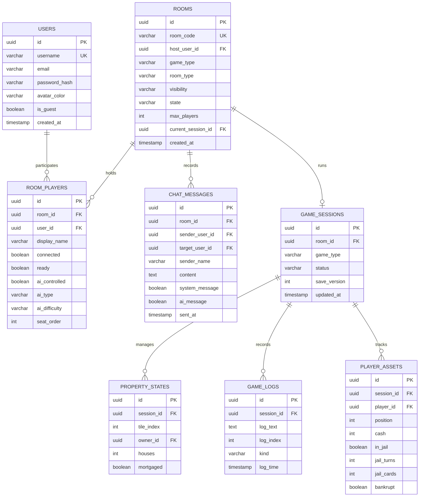

# Project Memory: Database Schema (database.md)

## Database Architecture
The backend uses a relational database schema designed to manage users, lobbies, active game configurations, and chat messages.

---

## Detailed Table Definitions

### 1. `USERS` Table
Stores account metadata for registered users and guest sessions.
* **Fields**:
  * `id` (UUID, Primary Key): Unique player identifier.
  * `username` (VARCHAR, Unique, Not Null): Login name and default display name.
  * `email` (VARCHAR, Nullable): Contact email (registered users only).
  * `password_hash` (VARCHAR, Nullable): Bcrypt hash (registered users only).
  * `avatar_color` (VARCHAR, Not Null): Hex value (e.g. `#00f2ff`) for rendering.
  * `is_guest` (BOOLEAN, Not Null): Identifies temporary guest sessions.

### 2. `ROOMS` Table
Tracks active multiplayer game lobbies.
* **Fields**:
  * `id` (UUID, Primary Key): Unique room identifier.
  * `room_code` (VARCHAR(4), Unique, Not Null): Alphanumeric code for joining.
  * `host_user_id` (UUID, Foreign Key -> `USERS.id`): Identifies the room host.
  * `game_type` (VARCHAR): Game configuration: `MAFIA` or `MONOPOLY`.
  * `room_type` (VARCHAR): Connection mode: `LAN` or `ONLINE`.
  * `visibility` (VARCHAR): Visibility configuration: `PUBLIC` or `PRIVATE`.
  * `state` (VARCHAR): Lobby lifecycle state: `LOBBY`, `PLAYING`, or `ENDED`.
  * `max_players` (INTEGER): Maximum player cap (typically 3–16).
  * `current_session_id` (UUID, Foreign Key -> `GAME_SESSIONS.id`, Nullable).

### 3. `ROOM_PLAYERS` Table
Maps users to lobbies and tracks ready states.
* **Fields**:
  * `id` (UUID, Primary Key).
  * `room_id` (UUID, Foreign Key -> `ROOMS.id`, On Delete Cascade).
  * `user_id` (UUID, Foreign Key -> `USERS.id`, Nullable): References User ID (null for AI players).
  * `display_name` (VARCHAR): Display name for the player.
  * `connected` (BOOLEAN): Tracks WebSocket connection state.
  * `ready` (BOOLEAN): Tracks lobby ready state.
  * `ai_controlled` (BOOLEAN): True if the seat is occupied by an AI player.
  * `seat_order` (INTEGER): Seat order index used to determine play order.

### 4. `GAME_SESSIONS` Table
Tracks active matches.
* **Fields**:
  * `id` (UUID, Primary Key).
  * `room_id` (UUID, Foreign Key -> `ROOMS.id`, On Delete Cascade).
  * `game_type` (VARCHAR): `MAFIA` or `MONOPOLY`.
  * `status` (VARCHAR): Session status: `WAITING_FOR_ROLL`, `WAITING_FOR_DECISION`, `WAITING_FOR_AUCTION`, `PAUSED`, `ENDED`.
  * `save_version` (INTEGER): Optimistic locking version count.

### 5. `PLAYER_ASSETS` Table
Tracks player assets in Monopoly matches.
* **Fields**:
  * `id` (UUID, Primary Key).
  * `session_id` (UUID, Foreign Key -> `GAME_SESSIONS.id`, On Delete Cascade).
  * `player_id` (UUID, Foreign Key -> `ROOM_PLAYERS.id`): References the player record.
  * `position` (INTEGER): Current board tile index (0–39).
  * `cash` (INTEGER): Cash balance (defaults to 1500).
  * `in_jail` (BOOLEAN): True if the player is in jail.
  * `jail_turns` (INTEGER): Consecutive turns spent in jail (0–3).
  * `jail_cards` (INTEGER): Number of "Get Out of Jail Free" cards owned.
  * `bankrupt` (BOOLEAN): True if the player has been bankrupted.

### 6. `PROPERTY_STATES` Table
Tracks property ownership and developments in Monopoly matches.
* **Fields**:
  * `id` (UUID, Primary Key).
  * `session_id` (UUID, Foreign Key -> `GAME_SESSIONS.id`, On Delete Cascade).
  * `tile_index` (INTEGER): Board index of the property (0–39).
  * `owner_id` (UUID, Foreign Key -> `ROOM_PLAYERS.id`, Nullable): References the owner.
  * `houses` (INTEGER): Number of houses built (0–4 houses, 5 = hotel).
  * `mortgaged` (BOOLEAN): True if the property is mortgaged.

---

## Constraints and Indexes

### Foreign Keys
* `ROOM_PLAYERS.room_id` -> `ROOMS.id` (`ON DELETE CASCADE`)
* `CHAT_MESSAGES.room_id` -> `ROOMS.id` (`ON DELETE CASCADE`)
* `PLAYER_ASSETS.session_id` -> `GAME_SESSIONS.id` (`ON DELETE CASCADE`)
* `PROPERTY_STATES.session_id` -> `GAME_SESSIONS.id` (`ON DELETE CASCADE`)

### Unique Constraints
* `USERS.username` (Unique index for logins).
* `ROOMS.room_code` (Unique index for joining lobbies).
* Composite Unique: `ROOM_PLAYERS(room_id, seat_order)` prevents seat overlaps.
* Composite Unique: `PROPERTY_STATES(session_id, tile_index)` prevents duplicate property entries.

### Key Indexes
* Index on `ROOM_PLAYERS.room_id` for fast query lookup when loading lobbies.
* Index on `CHAT_MESSAGES.room_id` ordered by `sent_at DESC` for loading chat history.
* Index on `USERS.username` for user lookup.
